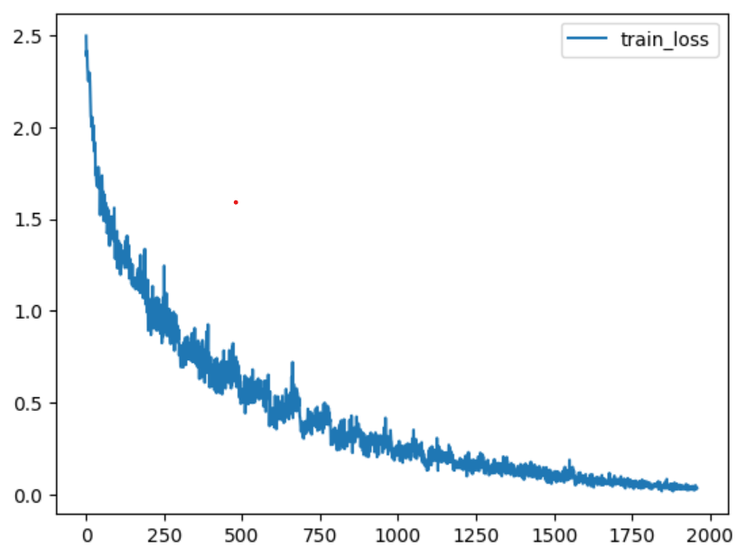
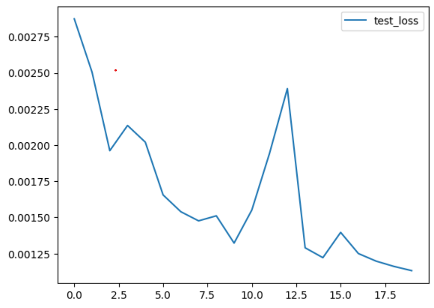
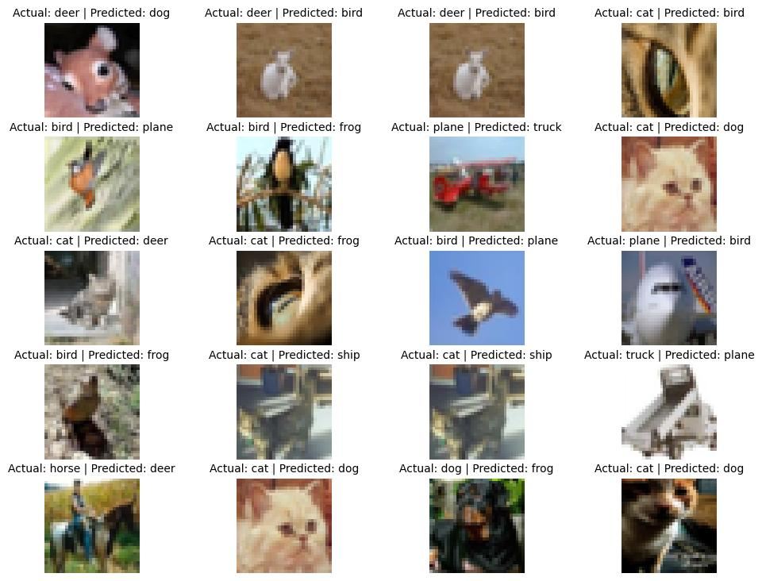
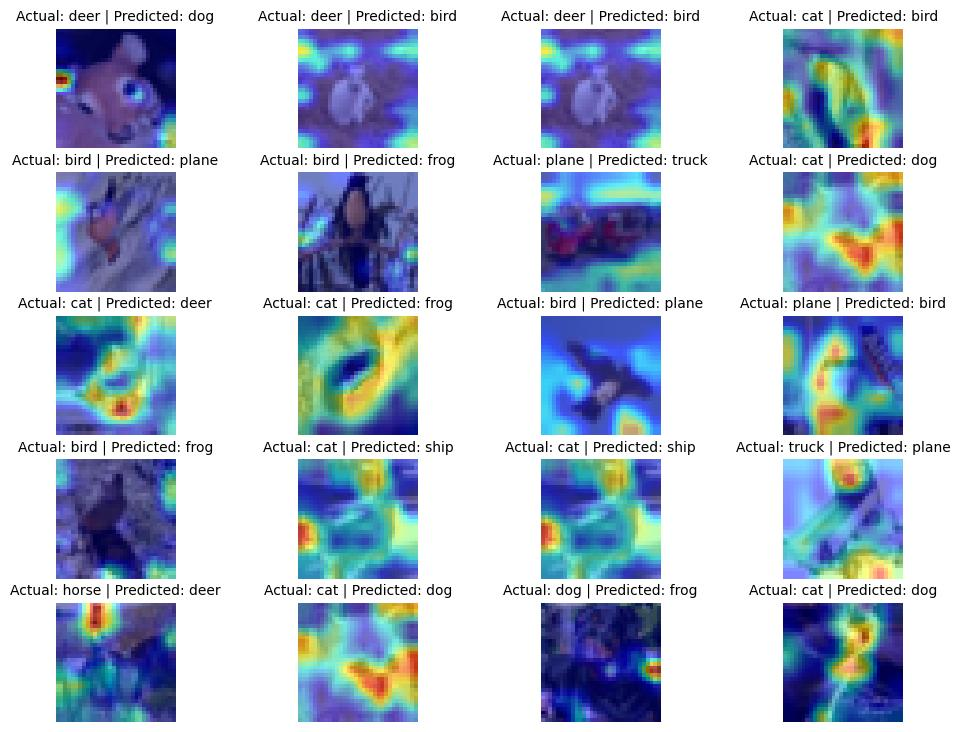

# GradCam Visualization of CIFAR-10 dataset with Albumentations

This PyTorch project focuses on building and training a RESNET18 deep learning model on the CIFAR-10 dataset. It includes various features such as data augmentation using the Albumentations library, a custom dataset loader, plotting train and test loss curves, GradCam visualization of randomly sampled misclassified images, and visualization of misclassified images with labels and appropriate legends.

## Getting Started

Follow the steps below to get started with the project:

1. Clone the repository:

   ```bash
   git clone https://github.com/acharyasunil/cifar10_grad_cam.git
   cd cifar10_grad_cam
   ```

2. Install the required packages:

   ```bash
   pip install -r requirements.txt
   ```

3. Download and preprocess the CIFAR-10 dataset:

   Before training the model, you need to download the CIFAR-10 dataset. You can use the `torchvision` library to download and preprocess the dataset. Apply data augmentation using Albumentations to increase the diversity of the training data.

## Training and Evaluation

1. Train the Model:

   To train the model on the CIFAR-10 dataset for 20 epochs, run the following command:

   ```bash
   python main.py
   ```
   OR
   Run S11.ipynb in jupyter notebook.

2. Evaluate the Model:

   After training, the model's performance will be evaluated on the test dataset automatically.

## Data Augmentation

In this project, data augmentation is performed using the Albumentations library. Augmentations like RandomCrop and Cutout are applied to the training data to enhance the model's generalization.

## Custom CIFAR-10 Dataset Loader

The project includes a custom dataset loader for CIFAR-10. The `CustomCIFAR10` class extends the PyTorch `Dataset` class and allows you to customize the data loading process.

## Loss Curve Visualization





## Misclassified Image Visualization




## GradCam Visualization of Misclassified Images

GradCam is used to visualize the regions of interest in the misclassified images that contribute to the model's predictions. The `gradcam.py` script can be used to apply GradCam to randomly sampled misclassified images.




## Conclusion

This PyTorch CIFAR-10 project provides a comprehensive pipeline for training and evaluating deep learning models on the CIFAR-10 dataset. With data augmentation, custom dataset loading, loss curve visualization, GradCam visualization, and misclassified image visualization, you can gain insights into the model's performance and identify misclassifications. Feel free to explore and modify the code to suit your needs and experiment with different model architectures and hyperparameters.